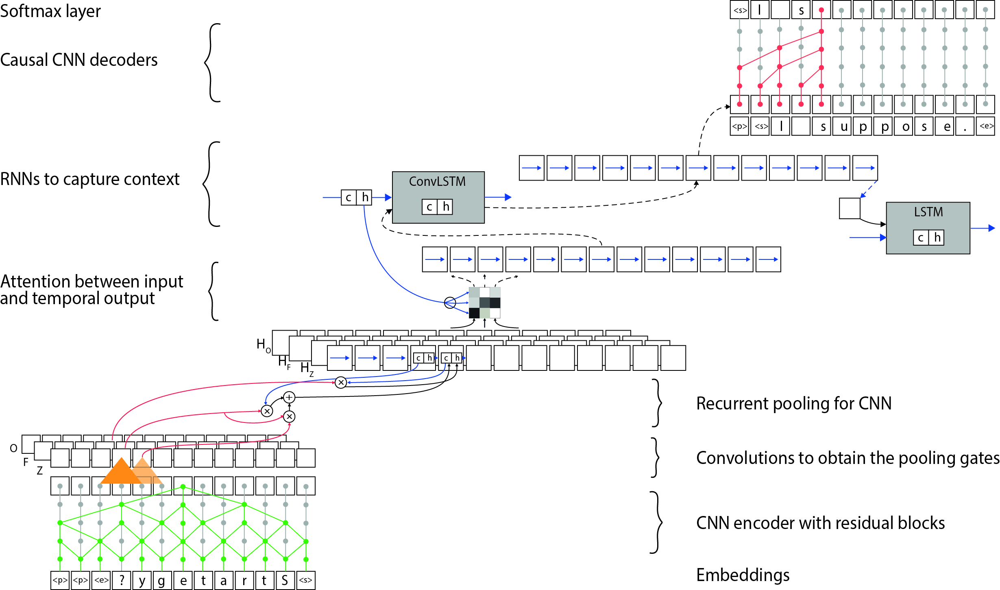

# Neural Opinion Generator

Tensorflow implementation of Opinion Generator. 

We propose a neural network to generate meaningfully linked sentences into one opinion.
The OpinionNet encodes tensors of opinions and uses sample driven approach for capturing the full
generality of interdependencies between the sentences and between characters. 

## Model

The architecture of OpinionNet consists of CNN encoders whose outputs are given to recurrent block to combine
sentences over time, and the produced context representations are used to condition the CNN decoder for character level generation (or LSTM for word level).
We present a model which captures a global ’pathway’ of an opinion as a response to another statement; which is an attempt to understand of how different opinions are formed, based on a "Change My View"
dataset. The quality and the undertone of generated opinions differ while using reinforcement learning or a cross-entropy objective.

 
<i>Structure of Opinion Generator. The source sentence is encoded (bottom left) with residual
blocks and, together with a context vector from ConvLSTM, fed through the attention block to
compute conditional inputs. The dashed lines correspond to layers of convolutional pooling. The
conditional input in concatenation with a target sentence are given as an input to the decoder (top
right). The temporal dimension of a sentence among all layers is preserved.</i> 

The OpinionNet is capable of computing the factorized distribution. It consists of three parts:
1. The CNN encoder, that models sentence representation.
2. Temporal block, that captures the essence of opinion and relations between sentences.
3. The CNN decoder, that is conditioned on outputs of the temporal block. It can be realized in word level or character level.

Objective function consists of:

1. Maximizing log-likelihood of data for encouraging the produced outputs to match the targets exactly. 
2. Self-critical policy gradient to maximize a scalar reward that evaluates the entire sequence rather than a word to word (or character to character) prediction. In particular, an advantage is computed as a difference of rewards received during the greedy search and during the sampling from the vocabulary distribution on the final layer.

In this implementation, we explore several ways of obtaining rewards. For instance, we use a BLEU score for computing rewards between the produced word sequence and a target sequence. Also, we use Sent2Vec to compute the distance between the embeddings of words of generated opinion and a target response.

## Dataset

To train our model we create a dataset using the ["Change My View"](https://www.reddit.com/r/changemyview/) Reddit forum that consists of opposing views. 
It is an appropriate dataset for training the Opinion Generator since it contains discussions on various topics with the main goal to understand opposing viewpoints.
We preprocess the raw data and create TFRecords for training and testing

## Credits
Tensorflow wrapper SugarTensor  [@buriburisuri](https://github.com/buriburisuri/sugartensor)

Implementation of Sent2Vec for computing rewards of generated opinions [@ryankiros](https://github.com/ryankiros/skip-thoughts)
